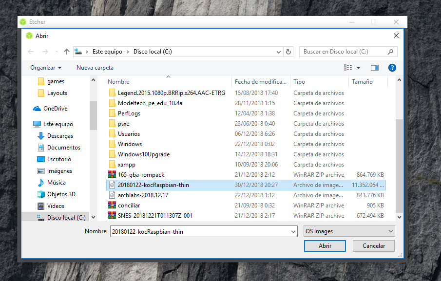

# Instrucciones para crear una imagen de Raspbian en una tarjeta SD
## 1.-Instale el programa etcher que le propocionaremos
  * Enseguida le aparecerá una ventana con la opción de "acepto" para iniciar la instalación.
  
## 2.-Ejecute el programa
  * Despues de finalizar la instalación, ejecute el programa.
  * Posteriormente aparecerá una ventana con 3 recuadros.
  * Hacer clic en el primer recuadro de color azul cielo.
  * Enseguida se abrirá un gestor de archivos en el que tendrá que seleccionar la imagen con extensión .img que se ha proporcionado.  
  
## 4.-Seleccionar el dispositivo
  * La opción del medio cambiará su color a azul cielo.
  * En esta opción tendrá que seleccionar el dispositivo en el que desea cargar la imagen.  
  
## 5.-Finalmente
  * Presione el último recuadro que tiene inscrito el nombre de "Flash!" para así proceder con la creación de la imagen.  
  
