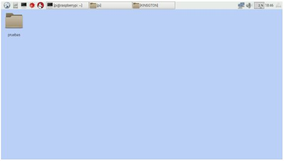
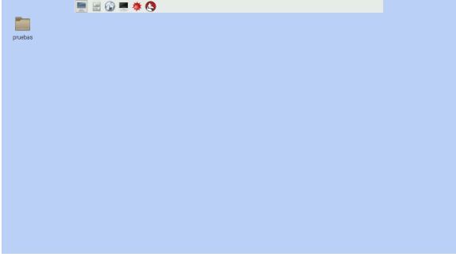
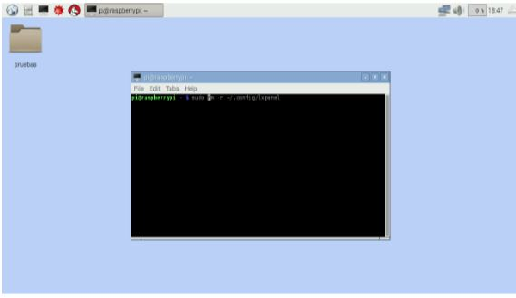
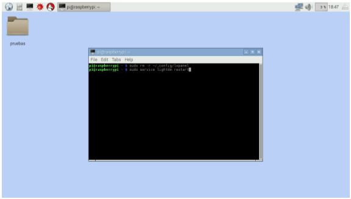

# Problema: Las dimensiones del escritorio cambian y el botón de inicio desaparece
Cuando hablamos del cambio en las dimensiones del escritorio nos referimos a que 
se ha alterado el tamaño de los iconos y las dimensiones de la barra de tareas.
Un problema que se presenta es que el botón de inicio ha sido movido y ahora no se puede ingresar de forma
gráfica a las aplicaciones.  
Se han agrupado estas dos fallas debido a que es un problema que se presenta
en la barra de tareas.
## Ejemplos:
* Cambio de dimensión.  



* El botón de inicio desaparece.  

  

## Solución 
### Paso 1:
Sobre una parte vacía del escritorio (que no contenga ningún icono) damos
clic derecho para ir a la opción de terminal, la cual nos abrirá el
siguiente panel, escribimos en ella el siguiente comando y damos enter.

```
sudo rm -r ~/.config/lxpanel
```

## Paso 2:
Una vez dada la entrada anterior ahora se procede a escribir el siguiente comando
```
sudo service lightdm restart
```


Con estos dos comandos se solucionan los dos problemas.
