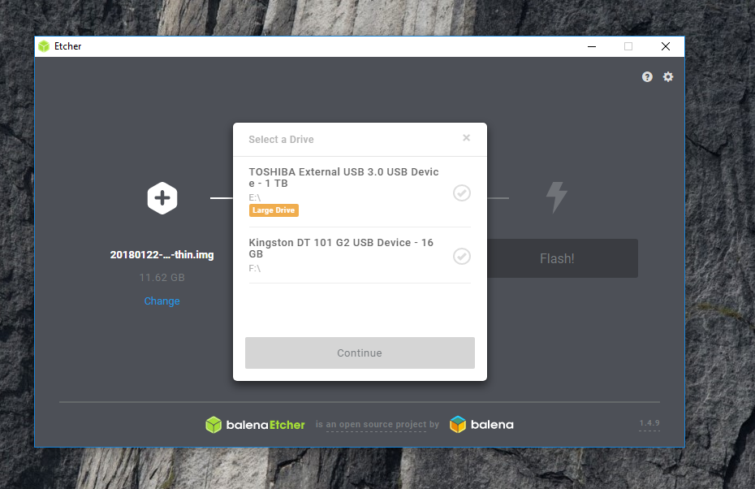
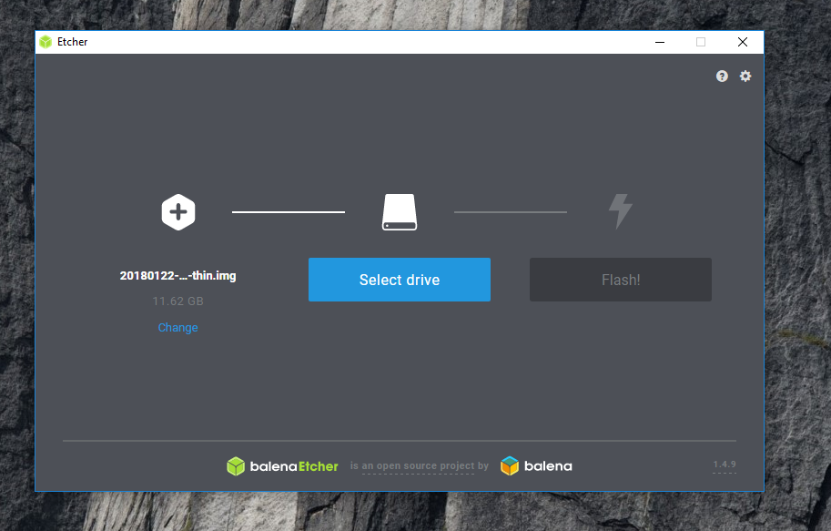
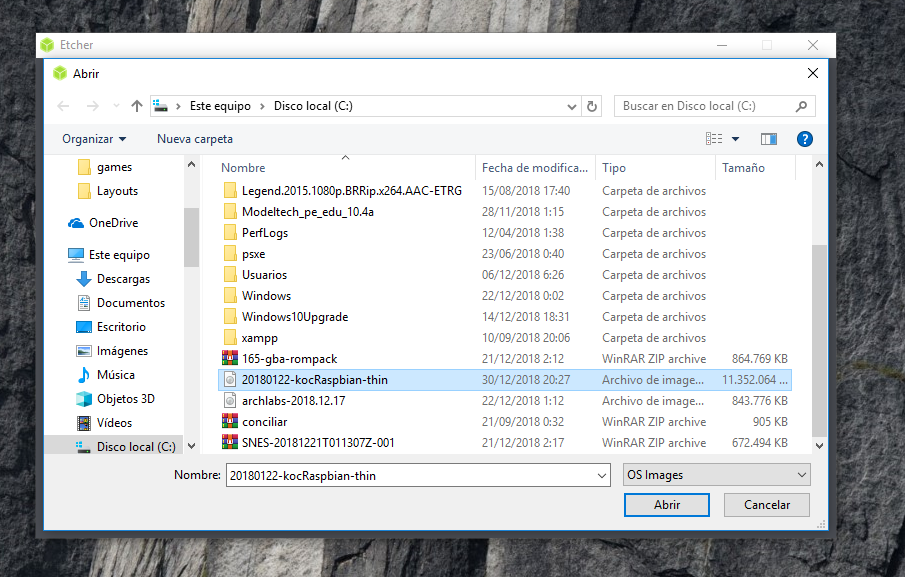
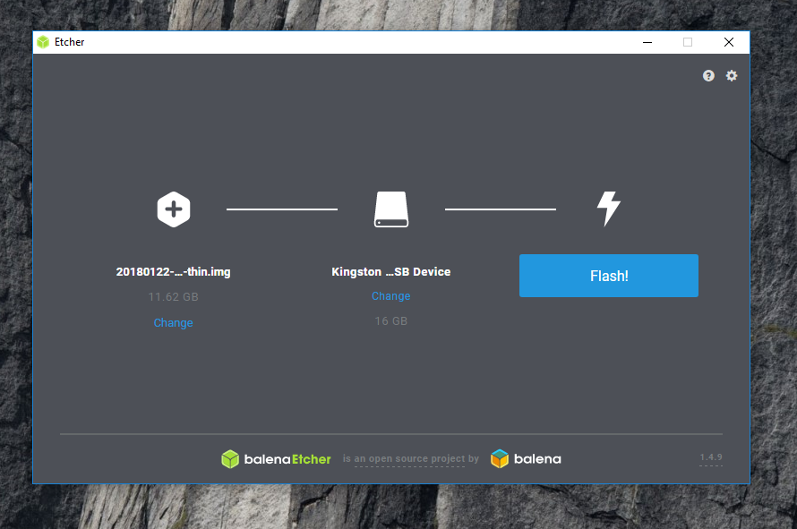

# Crear una imagen de Raspbian en una tarjeta SD
Antes de comenzar con estos pasos, usted debe de contar con un dispositivo USB conectado a su PC para poder almacenar la imagen.

## 1.-Instale el programa etcher 
  * Este programa se le proporcionará.
  * Se muestra una ventana con la opción de **acepto** para iniciar la instalación.

  La siguiente imagen muestra un ejemplo:
  
## 2.-Ejecute el programa
  * Después de finalizar la instalación, ejecute el programa.
  * Posteriormente aparecerá una ventana con 3 recuadros.
En la siguiente imagen se muestra un ejemplo:

  * Hacer clic en el primer recuadro de color azul cielo.
  * Se abre un gestor de archivos, seleccionar la imagen con extensión **.img** que se le ha proporcionado.

  La siguiente imagen muestra un ejemplo: 
  
## 3.-Seleccionar el dispositivo
  * La opción del medio cambiará su color a azul cielo.
  * Seleccionar el dispositivo en el que desea cargar la imagen.

La siguiente imagen muestra un ejemplo: 

## 4.-Creación de la imagen
  * Presione el último recuadro que tiene inscrito el nombre de **Flash!** y espere para concluir con la creación de la imagen.

La siguiente imagen muestra un ejemplo:
