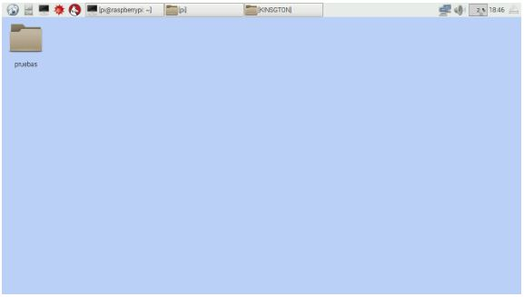
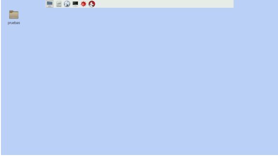
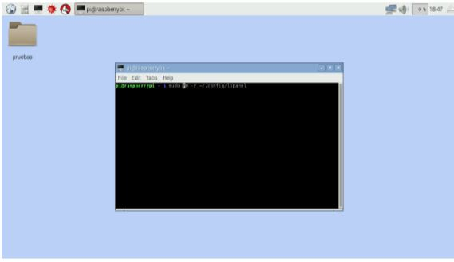
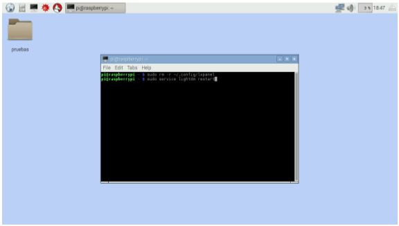

# Modificar las dimensiones del escritorio y restablecer la posición del botón de inicio.

**Problema:** Se ha alterado el tamaño de los iconos y las dimensiones de la barra de tareas.

La siguiente imagen nos muestra un ejemplo:


**Problema:** El botón de inicio ha sido movido y ahora no se puede ingresar de forma gráfica a las aplicaciones.

La siguiente imagen nos muestra un ejemplo:
  

Para corregir estos problemas debemos seguir los siguientes pasos:

Sobre una parte vacía del escritorio (que no contenga ningún icono) damos clic derecho para ir a la opción de terminal.

Escribimos el siguiente comando:

```
sudo rm -r ~/.config/lxpanel
```
  
Una vez dada la entrada anterior, escribimos el siguiente comando:
```
sudo service lightdm restart
```


Una vez que se hayan realizado estos pasos, las dimensiones del escritorio y el botón de inicio deben estar normales.
