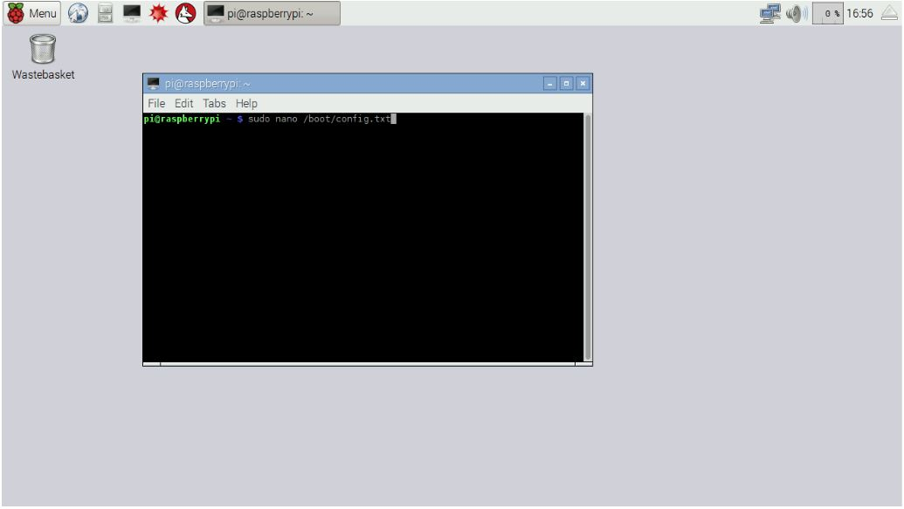
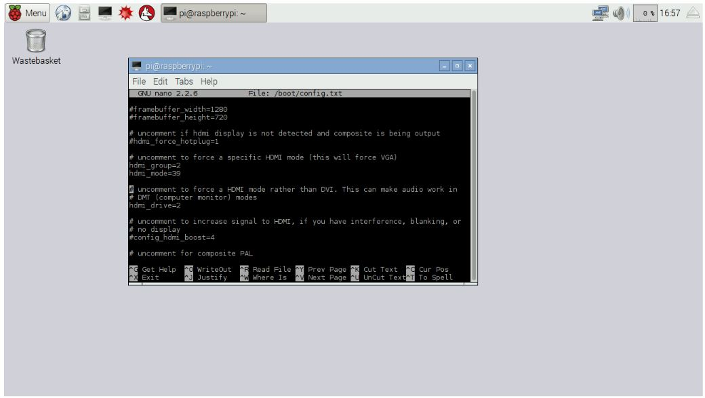
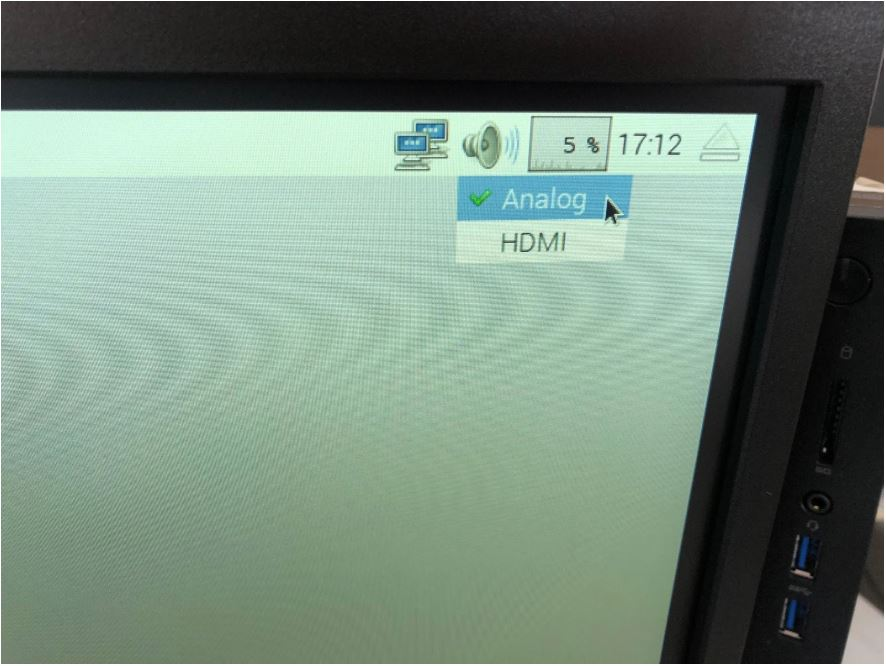

# Modificar la resolución de la pantalla y hacer correcciones con el sonido.

## MODIFICAR LA RESOLUCIÓN DE LA PANTALLA
**Problema:** Al conectar la tarjeta Raspberry Pi a un monitor con una resolución distinta, esta no se ajusta de forma automática y sus dimensiones no
permiten que el usuario tenga un ambiente adecuado de trabajo.

Para poder corregir este problema debemos realizar los siguientes pasos:

Sobre una parte vacía del escritorio (que no contenga ningún icono) damos clic derecho para ir a la opción de terminal.

Escribir el siguiente comando:
```
sudo nano/boot/config.txt
```
La siguiente imagen muestra un ejemplo:  

  

Se abrirá un archivo del cual tenemos que buscar y eliminar
los simbolos **#** de las siguientes lineas:
```
#hdmi_group=2 //Es el tipo de salida HDMI( 1 por defecto): 1=CEA y 2=DMT
#hdmi_mode=39 //Resolución de salida (configurar el valor según la tabla de la pagina// elinux)
#hdmi_drive=2 //Si el formato elegido es el DMT.
```
Se muestra un ejemplo en la siguiente imagen:  



Una vez que se hayan realizado estos pasos, la resolución de la pantalla debe ser la adecuada.

### Fuentes
* Modificar **config.txt** http://ieeesb-uniovi.es/talleres-charlas/linux/raspberry-pi/  
* Para poder cambiar la resolución de acuerdo a nuestro monitor debemos consultar una lista con los distintos
tipos de resolución en el siguiente enlace http://elinux.org

## RESTABLECER SONIDO
**Problema:** No se escucha el audio, dependiendo si el monitor tiene
bocinas externas o la salida es a través de audifonos. Para solucionar este problema, se muestran dos formas.
### Forma 1
Abrir la terminal y escribir el siguiente comando, así cambiará la salida de audio a HDMI.
```
amixer cset numid=3 1
```

Si el monitor no tiene bocinas externas, cambiamos la salida por análogica (salida de audífonos) y esta se establece a 1 en la configuración, en caso que si las tenga, la salida es 2.  
El ajuste predeterminado es 0 (automático).

### Forma 2
En la esquina superior derecha hay un icono en forma de bocina, se selecciona y despliega dos opciones: 
  * Analógica
  * HDMI

Se muestra un ejemplo en la siguiente imagen:
