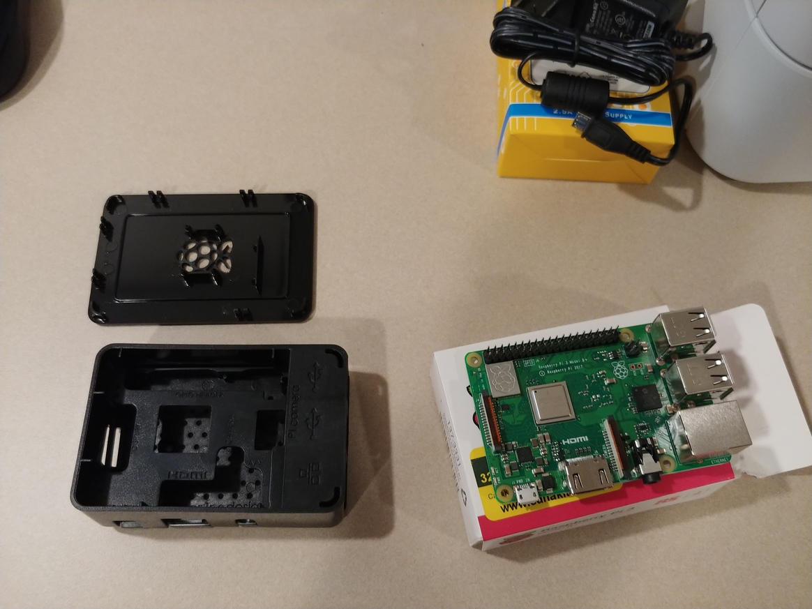
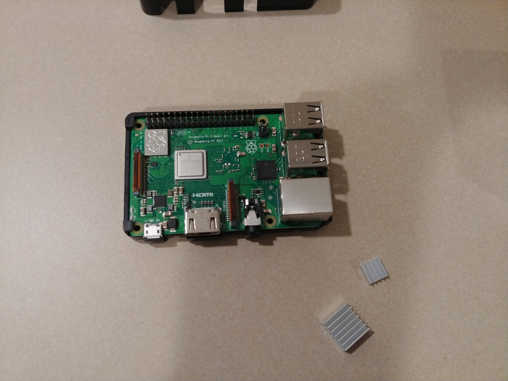
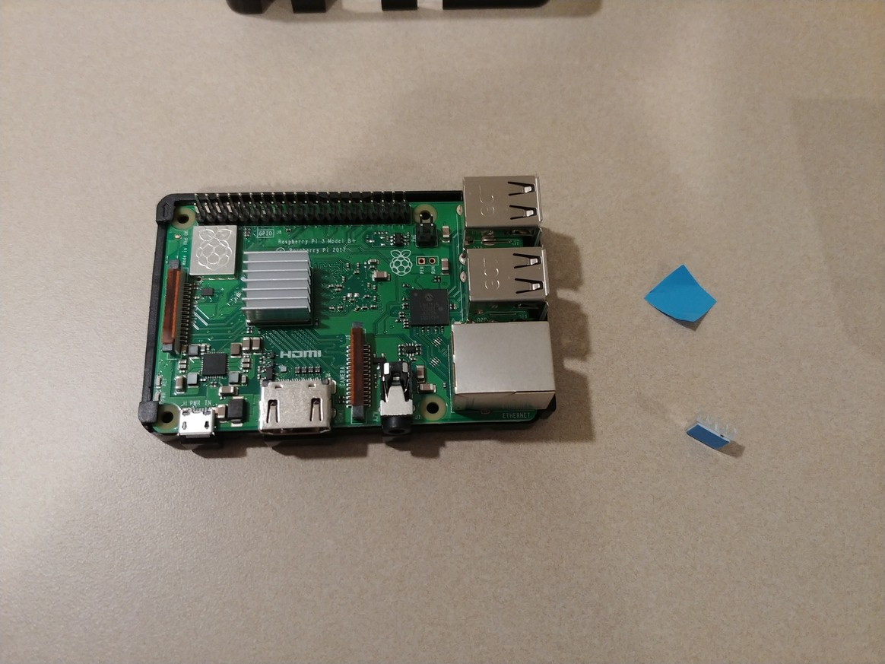
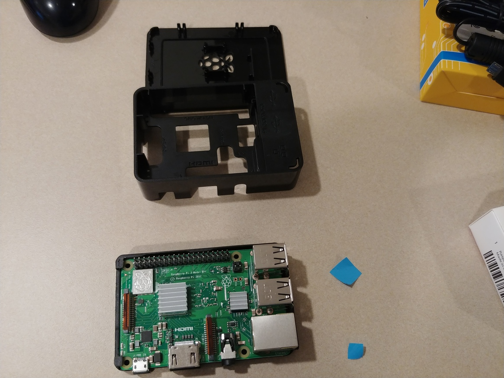
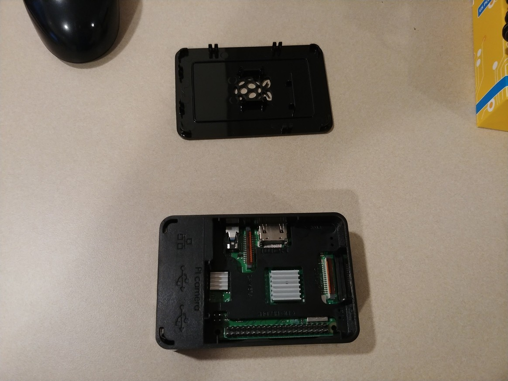
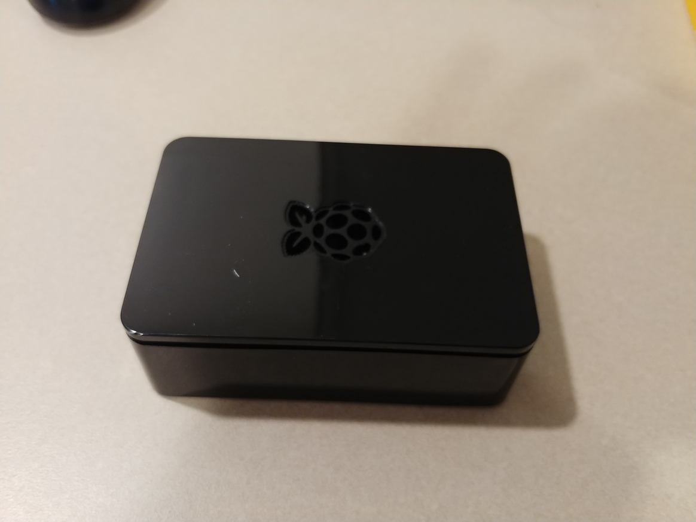
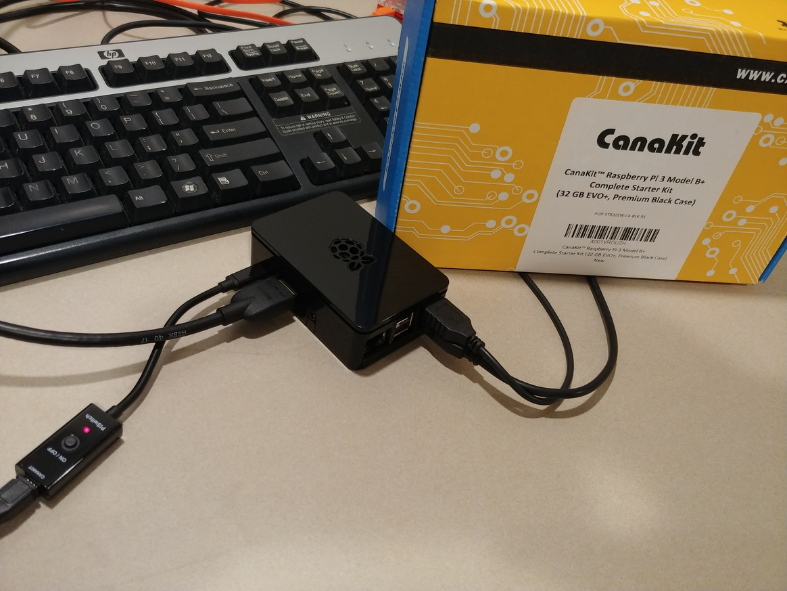
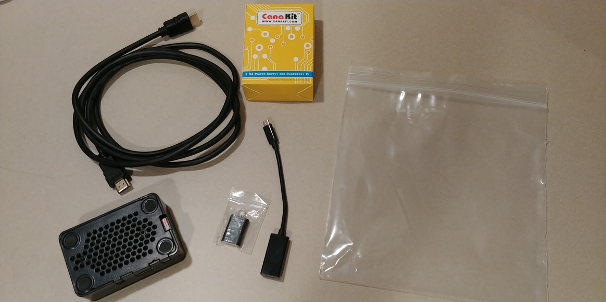
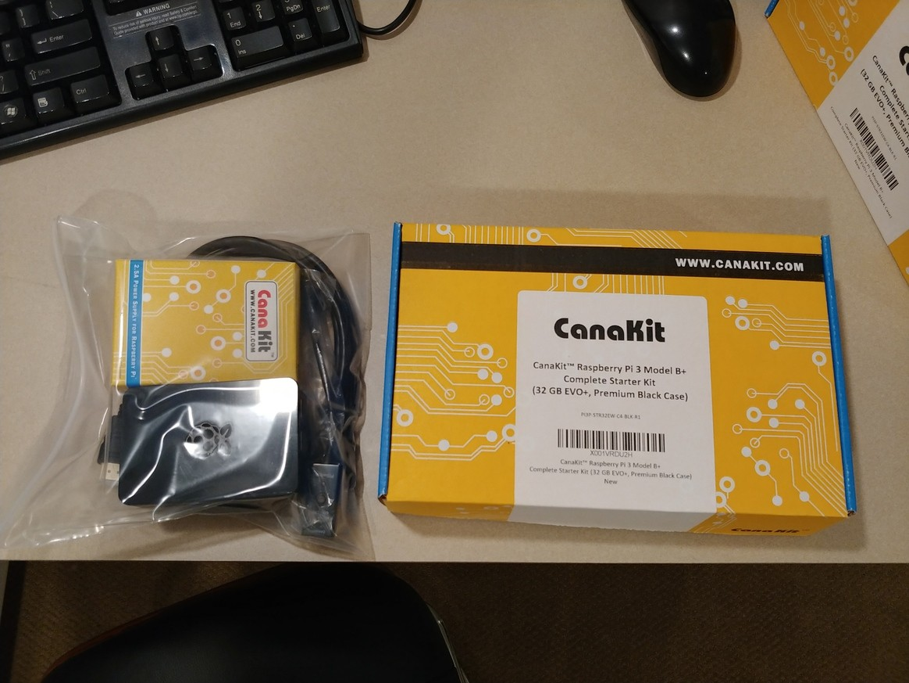

## Raspberry Pi
### Unboxing and Physical Setup

#### Kit
The Rapsberry Pi Kits being used for KoC/Mwebaza schools
in Uganda is:  [CanaKit Raspberry Pi 3 B+ (B Plus) Starter Kit (32 GB EVO+ Edition, Premium Black Case)](https://www.amazon.com/dp/B07BCC8PK7)

#### Setup

----
##### Unboxed

----
##### Before Adding Heat Sinks

----
##### After 1st Heat Sink

----
##### After 2nd Heat Sink

----
##### In case

----
##### Complete

----
##### Connected to USB keyboard/mouse, HDMI, and power

----
##### Contents packaged in zip-lock bag

Components in bag:
* Raspberry Pi in Case
  * Including 32GB card inserted into SD slot
* USB MicroSD Card Reader
* HDMI Cable
* PiSwitch (On/Off Power Switch for Raspberry Pi)
* Power supply (leave it in the power supply box, since the cord is messy)

